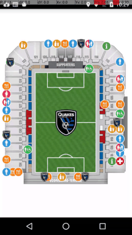

PointScrollView
---

a scrollview Imitation ios uiscrollview,make it support sroll weiget when zoom

| Effect |
| --- |
|  |

Usage
====

To use ShowcaseView, use the Builder pattern.

As an example:

~~~
 PointScrollView mapview = (PointScrollView) findViewById(R.id.mapview);
 mapview.setMap("map_stadium.jpg");
 mapview.drawPoint(point.x,point.y,point.getDrawableRes(this),point);
 mapview.removeAllViews();//remove all points(except map)
~~~

Copyright and Licensing
----

Copyright george.yang ([my log](http://blog.csdn.net/u010499721)) © 2014-2015. All rights reserved.

This library is distributed under an MIT License.